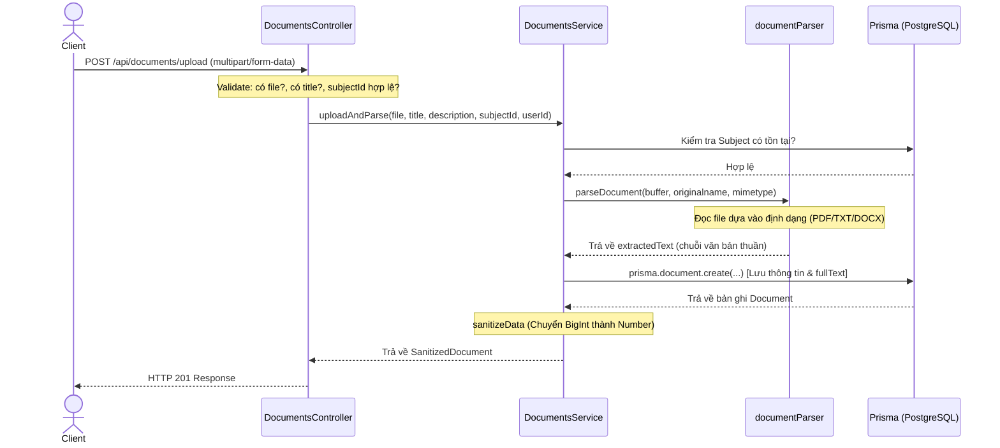
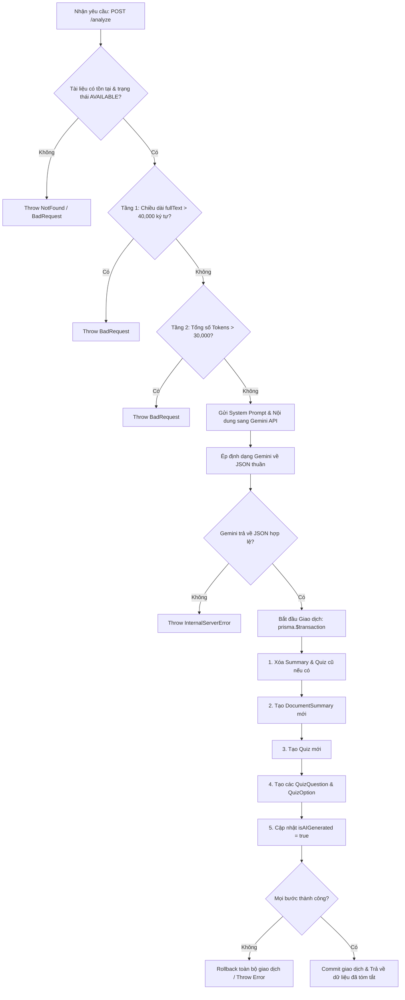

# Tài Liệu Giải Thích Hoạt Động Xử Lý Tài Liệu & AI Tích Hợp (Backend)

Tài liệu này giải thích chi tiết cơ chế hoạt động của luồng Tải lên (Upload & Parse) và Phân tích nội dung (Analyze/AI Generation) trong Module Documents của dự án.

---

## 1. Kiến Trúc Tổng Quan

Hệ thống tuân thủ nguyên tắc Domain-Driven Design (DDD) và NestJS Architecture:
1. **Controller (`DocumentsController`)**: Tiếp nhận HTTP Request, thực hiện validate dữ liệu đầu vào cơ bản và đóng gói dữ liệu trả về với định dạng chuẩn (`{ statusCode, message, data }`).
2. **Service (`DocumentsService`)**: Chứa logic nghiệp vụ cốt lõi, bao gồm kiểm tra phòng thủ bảo mật (3-Layer Defense), gọi Google Gemini API, và thực thi các giao dịch cơ sở dữ liệu (Database Transactions).
3. **Utility (`documentParser`)**: Chịu trách nhiệm trích xuất văn bản thuần (plain text) từ các định dạng tệp đầu vào (`.pdf`, `.txt`, `.docx`).
4. **Types (`document.types`)**: Định nghĩa cấu trúc dữ liệu chặt chẽ (đã được loại bỏ các thuộc tính không an toàn hoặc kiểu dữ liệu `any`).

---

## 2. Chi Tiết Luồng Tải Lên: `uploadAndParse`

Luồng này chịu trách nhiệm nhận tệp tài liệu học tập từ người dùng, trích xuất toàn bộ văn bản và lưu trữ thông tin vào cơ sở dữ liệu.

### Biểu đồ tuần tự (Sequence Diagram)

### Các bước xử lý chi tiết trong Code:
1. **Xác thực dữ liệu ở Controller**:
   * Kiểm tra tệp đính kèm (`file`).
   * Kiểm tra tiêu đề (`title`) và mã môn học (`subjectIdStr`).
   * Chuyển đổi mã môn học sang số nguyên.
2. **Kiểm tra nghiệp vụ ở Service**:
   * Kiểm tra môn học (`subjectId`) có tồn tại trong cơ sở dữ liệu hay không.
   * Xác định tài khoản người tải lên (`userId`), nếu không được cung cấp sẽ tự động gán cho người dùng đầu tiên (hỗ trợ môi trường test).
3. **Trích xuất văn bản thuần (`documentParser`)**:
   * **TXT**: Đọc buffer trực tiếp bằng `buffer.toString('utf-8')`.
   * **PDF**: Sử dụng thư viện `pdf-parse` (bản v2). Khởi tạo `new PDFParse({ data: buffer })`, chạy `.getText()` để lấy văn bản thuần, và dùng `.destroy()` để giải phóng bộ nhớ.
   * **DOCX**: Sử dụng thư viện `mammoth` để đọc tệp Word và trích xuất raw text.
   * **DOC (cũ)**: Cố gắng parse bằng `mammoth` (phòng trường hợp đổi tên đuôi), nếu thất bại sẽ ném lỗi yêu cầu người dùng chuyển đổi tệp sang `.docx` hoặc `.pdf` trước khi tải lên.
4. **Lưu trữ dữ liệu**:
   * Lưu trữ các siêu dữ liệu (tên file, kích thước, định dạng, đường dẫn lưu trữ) kèm nội dung văn bản thuần vừa trích xuất vào trường `fullText` trong bảng `documents`.
   * Chuyển đổi thuộc tính `fileSize` từ kiểu dữ liệu `BigInt` (do PostgreSQL trả về) sang `Number` thông qua hàm `sanitizeData` trước khi trả về Controller để tránh lỗi crash khi NestJS serialize JSON.

---

## 3. Chi Tiết Luồng Phân Tích AI & Tạo Quiz: `analyze`

Luồng này là nơi tích hợp trí tuệ nhân tạo (Google Gemini) để sinh nội dung học tập thông minh. Nó được bảo vệ nghiêm ngặt bằng cơ chế phòng thủ 3 tầng và giao dịch cơ sở dữ liệu.

### Biểu đồ luồng (Flowchart)

### Các bước xử lý chi tiết trong Code:

#### Tầng Phòng Thủ 3 Lớp (3-Layer Defense)
*   **Lớp 3 (Logic & Trạng thái)**: Hệ thống kiểm tra xem tài liệu có tồn tại không và trạng thái của nó phải là `AVAILABLE`. Tài liệu phải có nội dung văn bản trong `fullText`.
*   **Lớp 1 (Độ dài ký tự)**: Kiểm tra ngay lập tức `fullText.length > 40000`. Nếu vượt quá, từ chối xử lý ngay lập tức (ném lỗi `BadRequestException`) để tiết kiệm băng thông và tài nguyên.
*   **Lớp 2 (Số lượng token thực tế)**: Sử dụng Gemini SDK gọi hàm `countTokens(text)`. Nếu số lượng token thực tế vượt quá `30,000 tokens`, hệ thống sẽ chặn và thông báo lỗi. Điều này giúp ngăn ngừa việc gửi dữ liệu quá lớn làm vượt hạn mức chi phí hoặc gây lỗi quá tải API của Gemini.

#### Prompt Engineering & Ép Định Dạng JSON (JSON Forcing)
Hệ thống cấu hình Gemini thông qua thuộc tính `responseMimeType: 'application/json'` và cung cấp một `systemInstruction` cực kỳ chi tiết quy định:
1. Ngôn ngữ trả về bắt buộc phải là **Tiếng Việt**.
2. Định dạng JSON bắt buộc phải tuân thủ schema:
   * `summary`: mảng các đối tượng chứa `heading` và `content` (tối thiểu 2 phần).
   * `keyPoints`: mảng các chuỗi ý chính nổi bật (từ 5 đến 7 ý).
   * `quizzes`: mảng chứa chính xác 5 câu hỏi trắc nghiệm. Mỗi câu hỏi gồm `question`, mảng `options` chứa đúng 4 đáp án và chỉ mục đáp án đúng `correctAnswer` (từ 0 đến 3).

#### Giao dịch Cơ sở dữ liệu (Prisma Transaction)
Để tránh tình trạng "orphan data" (dữ liệu mồ côi - ví dụ như lưu được Summary nhưng lỗi không lưu được câu hỏi Quiz dẫn tới dữ liệu bị rác), toàn bộ quá trình ghi được bọc trong `prisma.$transaction`:
1. **Dọn dẹp**: Xóa các Summary và Quiz cũ đã liên kết với tài liệu này (cho phép người dùng bấm phân tích lại nhiều lần mà không bị nhân bản bản ghi).
2. **Ghi DocumentSummary**: Tạo bản ghi tóm tắt mới.
3. **Ghi Quiz**: Tạo tiêu đề Quiz mới.
4. **Ghi QuizQuestion & QuizOption**: Duyệt qua từng câu hỏi do AI sinh ra, tạo câu hỏi và đồng thời tạo 4 lựa chọn đáp án, đánh dấu lựa chọn có chỉ mục bằng `correctAnswer` là `isCorrect = true`.
5. **Cập nhật Document**: Chuyển cờ `isAIGenerated` của tài liệu thành `true`.

Nếu bất kỳ bước nào trong 5 bước trên gặp lỗi (ví dụ: mất kết nối DB giữa chừng, hoặc dữ liệu không khớp kiểu), hệ thống sẽ **tự động hoàn tác (rollback)** mọi thay đổi đã thực hiện trong phiên giao dịch đó để bảo vệ tính toàn vẹn của Cơ sở dữ liệu.

---

## 4. Hệ Thống Kiểu Dữ Liệu An Toàn (Safe Returns)

Để loại bỏ các cảnh báo và lỗi `unsafe` của ESLint (`@typescript-eslint/no-unsafe-return`, `no-explicit-any`), hệ thống sử dụng các kiểu dữ liệu khai báo tường minh trong `src/documents/types/document.types.ts`:

*   **`SanitizedDocument`**: Loại bỏ kiểu dữ liệu `bigint` của trường `fileSize` trong Prisma gốc và ép về kiểu `number`.
*   **`SanitizedQuizQuestion` & `SanitizedQuiz`**: Khai báo rõ ràng các quan hệ lồng nhau (`Quiz` chứa mảng các `QuizQuestion`, mỗi `QuizQuestion` chứa mảng các `QuizOption`).
*   **`SanitizedDocumentDetails`**: Định nghĩa cấu trúc trả về đầy đủ của thông tin chi tiết một tài liệu (gồm metadata, summary và các quiz).
*   **`AnalyzeResult`**: Cấu trúc kiểu dữ liệu trả về cho API Phân tích AI.
